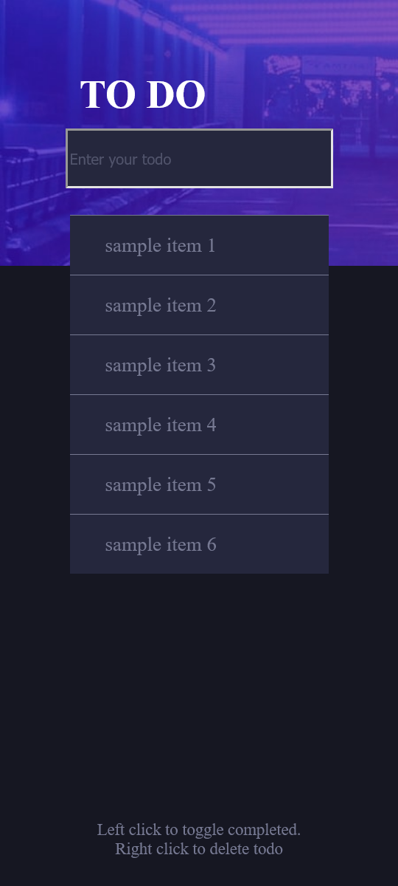

# Frontend Mentor - Todo app solution

This is a solution to the [Todo app challenge on Frontend Mentor](https://www.frontendmentor.io/challenges/todo-app-Su1_KokOW). Frontend Mentor challenges help you improve your coding skills by building realistic projects. 

## Table of contents

- [Overview](#overview)
  - [The challenge](#the-challenge)
  - [Screenshot](#screenshot)
  - [Links](#links)
- [My process](#my-process)
  - [Built with](#built-with)
  - [What I learned](#what-i-learned)
  - [Continued development](#continued-development)
- [Author](#author)
- [Acknowledgments](#acknowledgments)

## Overview

### The challenge

Users should be able to:

- View the optimal layout for the app depending on their device's screen size
- Add new todos to the list
- Mark todos as complete
- Delete todos from the list

### Screenshot

### Links

- Solution URL: [https://www.frontendmentor.io/solutions/to-do-list-local-storage-oY8Z7AmP2h]
- Live Site URL: [https://keithgaines.github.io/todolist/]

## My process

### Built with

- Semantic HTML5 markup
- CSS custom properties
- Flexbox
- Mobile-first workflow
- JQuery
- Bootstrap
- JavaScript Local Storage

### What I learned

Through completing the To Do List project, I gained experience working with JavaScript, jQuery, and localStorage. I learned how to add event listeners and handle form submissions, dynamically create and modify HTML elements, and store and retrieve data using localStorage. I also developed problem-solving skills and learned how to effectively use console.log and other debugging techniques to troubleshoot issues. Overall, this project provided a great opportunity to apply my programming knowledge in a practical way and further develop my skills.

### Continued development

As part of my continued development, I aim to deepen my understanding of jQuery and DOM manipulation. I have found that these skills are essential for developing dynamic and interactive web applications. By further developing my knowledge in these areas, I hope to be able to build more complex and sophisticated web applications that provide a better user experience. I plan to continue practicing my skills in jQuery and DOM manipulation by working on projects that challenge me and push my understanding of these topics.

## Author

- Website - [Keith Gaines](https://keithgaines.github.io)
- Frontend Mentor - [@keithgaines] (https://www.frontendmentor.io/profile/keithgaines)

## Acknowledgments

Shoutout to Brad Traversy for his course "50 Projects in 50 Days - HTML, CSS, & JavaScript" on Udemy. This helped me really understand how to use JavaScript to work with local storage and the overall JS logic of the project. From his example (written in vanilla JS), I was able to understand the concept enough to re-write it myself into JQuery. 